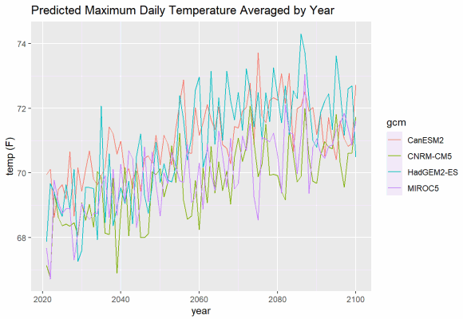

# Time-Series Plots

In this chapter we'll look at how to make some time series plots with Cal-Adapt data.

## Load Packages

As always, begin by loading a bunch of packages into memory and specifying preferences for conflicting function names.

```{r load_libraries, message = FALSE, warning = FALSE}
library(caladaptr)
library(units)
library(ggplot2)
library(dplyr)
library(tidyr)
library(lubridate)
library(sf)
```

Set conflicted preferences:

```{r}
library(conflicted)
conflict_prefer("filter", "dplyr", quiet = TRUE)
conflict_prefer("count", "dplyr", quiet = TRUE)
conflict_prefer("select", "dplyr", quiet = TRUE)
```

## Time Series Plots

In this section our goal is to create **time series plot** of projected maximum annual temperature for a **single point**, using the **four recommended GCMs** for California under RCP 4.5.

{style="display:block; width:580px; height:400px; margin:1em auto; border:none;"}

### Fetch Some Data

First we create an API request object that will ask the Cal-Adapt API to send back data for:

- maximum daily temperature, averaged by year (on the server)   
- a point location (outside Salinas, CA)   
- the first four CGMs (`r paste(gcms[1:4], collapse = ", ")` - the four 'priority' models recommended for California under the 4th Climate Change Assessment)  
- two emissions scenarios (rcp45 and rcp85)
- the time period 2006-2099  

```{r salns_cap, results='hold'}
salns_cap <- ca_loc_pt(coords = c(-121.549945, 36.643642)) %>%
  ca_gcm(gcms[1:4]) %>%                                 
  ca_scenario(c("rcp45", "rcp85")) %>%
  ca_period("year") %>%
  ca_years(start = 2006, end = 2099) %>%
  ca_cvar(c("tasmin", "tasmax"))
```

Check the API request for issues:

```{r}
salns_cap %>% ca_preflight()
```

Fetch data:

```{r salns_tbl, cache=TRUE}
salns_tbl <- salns_cap %>% ca_getvals_tbl(quiet = TRUE)
```

```{r glimpse_salns_tbl, cache=TRUE}
glimpse(salns_tbl)
```

The `val` column contains the temperature values with the units recorded (i.e., a units object from the `units` package). But Kelvin is not very intuitive. Let's add a column with the temperatures in Fahrenheit. Because we already have the temperature values as a units object, we can convert them with `units::set_units()`. 

```{r}
salns_degf_tbl <- salns_tbl %>% 
  mutate(temp_f = units::set_units(val, degF))

glimpse(salns_degf_tbl)
```

\

### Plot 1. Single Climate Variable & Single RCP

Our table has a lot of data combined: two climate variables, four GCMs, and two emissions scenarios. Each combo of those variables constitutes a time series, so we have 16 time series in total. 

We'll start by plotting just a single time series (one climate variable, one GCM, one scenario). Because our table is in 'long' format, we can easily filter it with `dplyr::filter()`:

```{r single_series_tbl, cache = TRUE}
single_series_tbl <- salns_degf_tbl %>% 
  filter(cvar == "tasmax", gcm == "HadGEM2-ES", scenario == "rcp45") %>% 
  select(dt, cvar, gcm, scenario, period, temp_f)

glimpse(single_series_tbl)
```

\

Plot with ggplot:

```{r plot_single_series_tbl, cache = TRUE}
ggplot(data = single_series_tbl, aes(x = as.Date(dt), y = as.numeric(temp_f))) +
  geom_line() +
  labs(title = "Predicted Maximum Daily Temperature Averaged by Year",
       caption = "Location: Salinas, CA. GCM: HadGEM2-ES; Emissions scenario: RCP4.5", 
       x = "year", y = "temp (F)")
```

\

If you want to plot multiple GCMs, you can differentiate them with colors. ggplot makes this easy, and will even create a legend for you. But although we can easily add lots of lines to a plot, it makes to sense to limit each plot to a single climate variables and a single emissions scenario.

```{r plot_mult_series_tbl, cache = TRUE}
mult_gcm_tbl <- salns_degf_tbl %>% 
  filter(cvar == "tasmax", scenario == "rcp45") %>% 
  select(dt, gcm, temp_f)

ggplot(data = mult_gcm_tbl, aes(x = as.Date(dt), y = as.numeric(temp_f))) +
  geom_line(aes(color=gcm)) +
  labs(title = "Predicted Maximum Daily Temperature Averaged by Year",
       caption = "Location: Salinas, CA. Emissions scenario: RCP4.5", 
       x = "year", y = "temp (F)")
```

\

## Multiple Emissions Scenarios

To plot multiple emissions scenarios, you probably want to use facets:

```{r}
mult_scen_tbl <- salns_degf_tbl %>% 
  filter(cvar == "tasmax") %>% 
  select(dt, gcm, scenario, temp_f)

ggplot(data = mult_scen_tbl, aes(x = as.Date(dt), y = as.numeric(temp_f))) +
  geom_line(aes(color=gcm)) +
  facet_grid(scenario ~ .) +
  labs(title = "Predicted Maximum Daily Temperature Averaged by Year",
       caption = "Location: Salinas, CA", 
       x = "year", y = "temp (F)")

```

\

## Overlay a Trend Line

ggplot can add a trend line for you (by adding `geom_smooth`), but you have to decide whether you want a trend line for each individual GCM, or perhaps all GCMs in the same emissions scenario. Below we overlay a trend line for each emissions scenario. 

```{r}
ggplot(data = mult_scen_tbl, aes(x = as.Date(dt), y = as.numeric(temp_f))) +
  geom_line(aes(color=gcm)) +
  geom_smooth(formula = y ~ x, method=lm, se=FALSE, col='red', size=1) +
  facet_grid(scenario ~ .) +
  labs(title = "Predicted Maximum Daily Temperature Averaged by Year",
       caption = "Location: Salinas, CA", 
       x = "year", y = "temp (F)")

```

\

## Historic and Future Data Together

Many studies on the impact of climate change look at the past as a reference for future climate conditions. Here we'll create a time series plot that goes all the way back to 1950.

The first question you have to ask is *what data should I use for the historic period?*. Your first reaction might be to use observed historic data (i.e., from weather stations). You can certainly do that, as the Cal-Adapt API has both the Livneh and gridMet datasets (both of which are observed data interpolated from weather stations).

However we don't have observed data for the future. This presents a problem because comparing observed past data with modeled future data is like comparing apples and oranges. They represent different things.

A better option is to compare the modeled future climate with a modeled historic climate. This may seem counter-intuitive, but the climate models have been trained from historic data, and have been shown to do a very good job at capturing the climate envelope of the past.

First we need to get the historic modeled data, for the same climate variable, GCMs, and location. caladaptR has no problem combining multiple datasets in the same API call, however in this case we need to make a separate API call for the historic data because the dates are different.

```{r salns_hist_cap}
salns_hist_cap <- ca_loc_pt(coords = c(-121.549945, 36.643642)) %>%
  ca_gcm(gcms[1:4]) %>%
  ca_scenario("historical") %>%
  ca_period("year") %>%
  ca_years(start = 1950, end = 2005) %>%
  ca_cvar(c("tasmin", "tasmax"))

salns_hist_cap %>% ca_preflight()
```

\

Next we get the values. While we're at it, we can add the column for degrees Fahrenheit:

```{r salns_hist_tbl}
salns_hist_tbl <- salns_hist_cap %>% 
  ca_getvals_tbl(quiet = TRUE) %>% 
  mutate(temp_f = units::set_units(val, degF))

head(salns_hist_tbl)
```

\

Our tibbles for the past and future time periods have identical columns, so we can stack them. While we're at it, we can convert the dt column from character to Date:

```{r salns_all_tbl}
salns_all_tbl <- salns_degf_tbl %>% 
  bind_rows(salns_hist_tbl) %>% 
  mutate(dt = as.Date(dt))

head(salns_all_tbl)
summary(salns_all_tbl %>% select(cvar, gcm, scenario, dt, temp_f))
```

\

To plot the time series from 1950 thru 2099, we have to pick one of the future scenarios.  

```{r}
salns_histrcp45_tbl <- salns_all_tbl %>% 
  filter(cvar == "tasmax", scenario %in% c("historical", "rcp45")) %>% 
  select(dt, gcm, temp_f)

salns_histrcp45_tbl

ggplot(data = salns_histrcp45_tbl, aes(x = as.Date(dt), y = as.numeric(temp_f))) +
  geom_line(aes(color=gcm)) +
  labs(title = "Predicted Maximum Daily Temperature Averaged by Year",
       caption = "Location: Salinas, CA. Emissions scenarios: Historical (1950-2005), RCP4.5 (2006-2099)", 
       x = "year", y = "temp (F)")

```

\

## Overlay a 32-model Ensemble 

In the examples above, we plotted the 4 'priority' GCMs out of the 10 recommended GCMs for California. But there are 22 other GCMs out there. To compare how the four (or ten) GCMs in a plot compare to the range of variability of all 32 GCMs, we can overlay the 32-ensemble model.

The 32-ensemble model is available for many but not all of the climate variables, temporal aggregations, or emission scenarios. You can see which ensemble raster series are available by searching the data catalog for 'ens32':

```{r ensem_rasterseries_df, cache = TRUE}
ensem_rasterseries_df <- ca_catalog_search("ens32", quiet = TRUE)
nrow(ensem_rasterseries_df)
ensem_rasterseries_df[1:6, c("slug", "name")]
```

There are 207 raster series that are derived from the 32-ensemble models. caladaptr doesn't have convenience functions that you can string together to specify the 32-ensemble raster series, so you need to find the slug(s) by searching the data catalog (see above). To overlay the 32-ensemble of daily maximum averaged by year, we need to first download the following slugs:

```{r}
salns_32ens_cap <- ca_loc_pt(coords = c(-121.549945, 36.643642)) %>%
  ca_slug(c("tasmax_year_ens32min_rcp45", "tasmax_year_ens32max_rcp45",
            "tasmin_year_ens32min_rcp45", "tasmin_year_ens32max_rcp45")) %>%
  ca_years(start = 2006, end = 2099)

salns_32ens_cap %>% ca_preflight()
```
```{r salns_32ens_tbl, cache = TRUE}
salns_32ens_tbl <- salns_32ens_cap %>% 
  ca_getvals_tbl(quiet = TRUE) 

glimpse(salns_32ens_tbl)
```

We need to make two changes: convert the date column from character to date, and add a column for degrees F.

```{r}
salns_32ens_tbl <- salns_32ens_tbl %>% 
  mutate(dt = as.Date(dt),
         temp_f = units::set_units(val, degF))  

head(salns_32ens_tbl)
```

\

Now we can plot the 32-ensemble min and max of the daily maximum temperature averaged by year as individual lines:

```{r}
ens_minmax_tbl <- salns_32ens_tbl %>% 
  filter(slug %in% c("tasmax_year_ens32min_rcp45", "tasmax_year_ens32max_rcp45")) %>% 
  select(dt, slug, temp_f)
  
ggplot(data = ens_minmax_tbl, 
       aes(x = dt, y = as.numeric(temp_f))) +
  geom_line(aes(color=slug)) +
  labs(x = "year", y = "temp (F)")
```

\

To have the area between the lines show up as a shaded area, we're going to use geom_ribbon. But geom_ribbon requires that the min and max series to be in separate columns (i.e., wide format instead of long format). Hence before we can plot it we need to reshape the data:


```{r ens_minmax_wide_tbl}
ens_minmax_wide_tbl <- ens_minmax_tbl %>% 
  tidyr::pivot_wider(names_from = slug, 
              values_from = temp_f,
              id_cols = dt)

head(ens_minmax_wide_tbl)
```

\

Now we can plot the area between the lines:

```{r plot_ens_minmax_wide_tbl}
ggplot(data = ens_minmax_wide_tbl, aes(x = dt)) +
  geom_ribbon(aes(ymin = as.numeric(tasmax_year_ens32min_rcp45), ymax = as.numeric(tasmax_year_ens32max_rcp45)), fill = "gray70")

## This works also (don't convert the units)
ggplot(data = ens_minmax_wide_tbl, aes(x = dt)) +
  geom_ribbon(aes(ymin = tasmax_year_ens32min_rcp45, ymax = tasmax_year_ens32max_rcp45), fill = "gray80")
```


\

Now we can combine our two plots. We'll start with the geom_ribbon and then lay the data series on top.

```{r glimpse_salns_degf_tbl, cache=TRUE}
ggplot(data = ens_minmax_wide_tbl, aes(x = dt)) +
  geom_ribbon(aes(ymin = as.numeric(tasmax_year_ens32min_rcp45), 
                  ymax = as.numeric(tasmax_year_ens32max_rcp45)), fill = "gray80") +
  geom_line(data = mult_gcm_tbl, 
            mapping = aes(x = as.Date(dt), y = as.numeric(temp_f), color = gcm)) +
  labs(title = "Predicted Maximum Daily Temperature Averaged by Year",
       caption = "Location: Salinas, CA. Emissions scenario: RCP4.5. Shaded background = 32-GCM ensemble",
       x = "year", y = "temp (F)")
```


## Visualize Variability with Histograms

Some climate variables like precipitation don't have a strong increasing or decreasing trend, but may see higher variability. Histograms are a good way to visualize distribution.

*Coming soon...*


